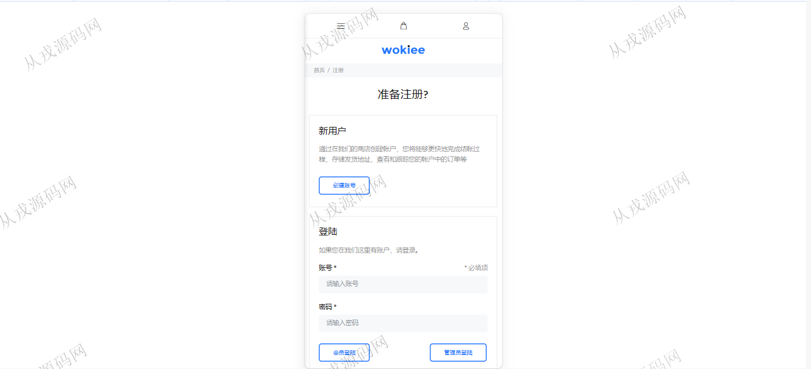
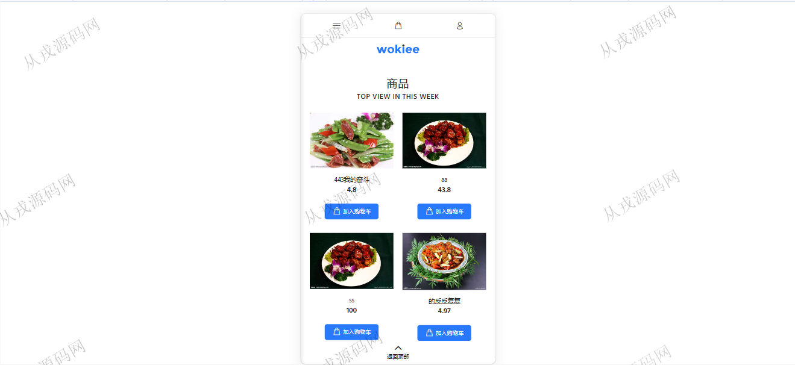
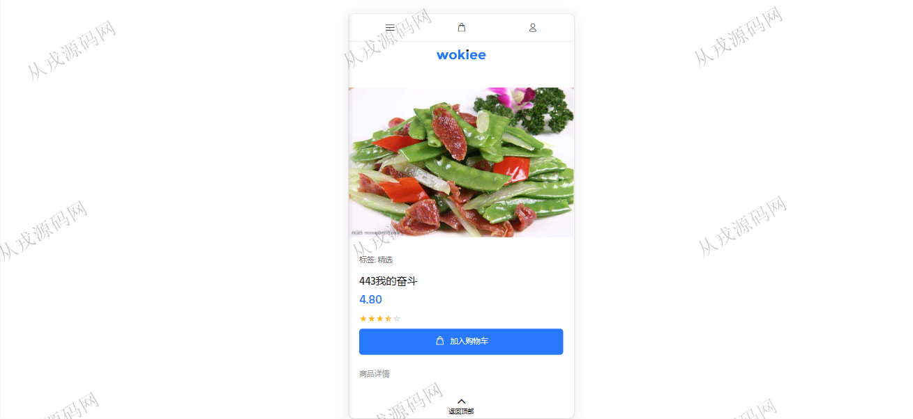
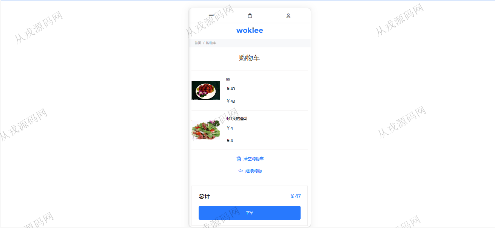
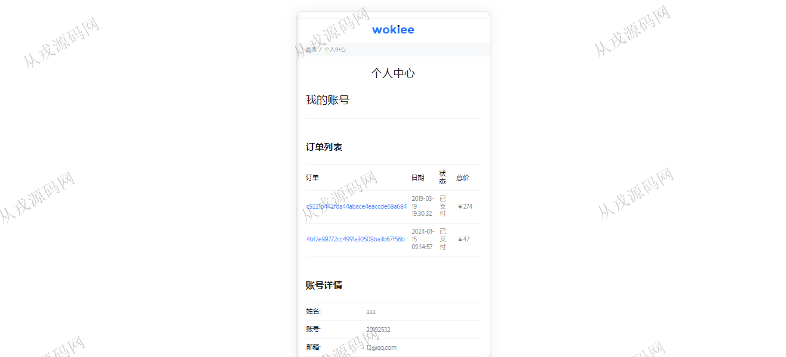
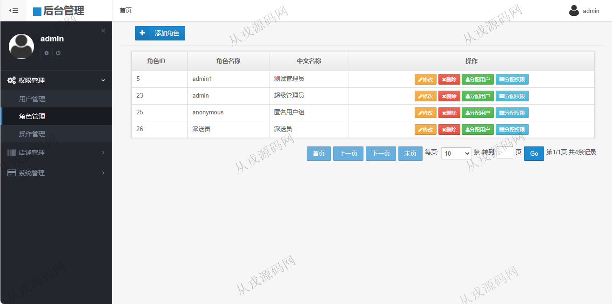
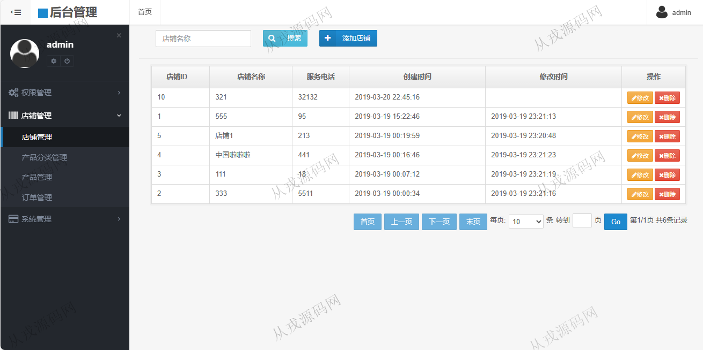
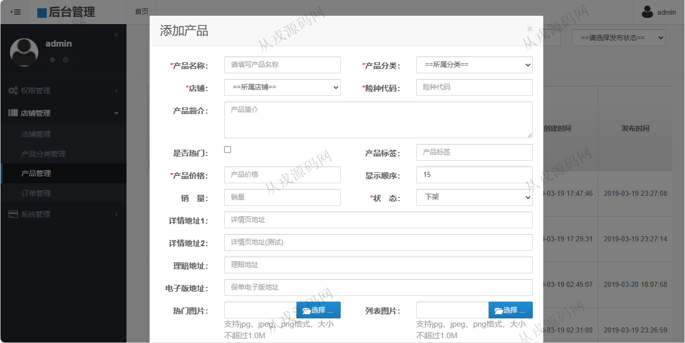
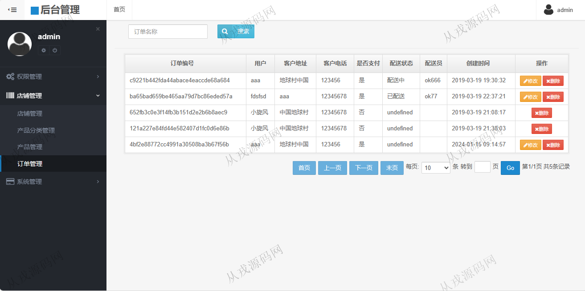

<h1 align="center">156.手机点餐管理系统</h1>

 获取sql文件 QQ: 386869957 QQ群: 377586148 

 [更多源码项目: 从戎源码网](https://armycodes.com/) 

## 简介

> 本代码来源于网络,仅供学习参考使用!
>
> 提供1.远程部署/2.修改代码/3.设计文档指导/4.框架代码讲解等服务
> 
> 访问地址: http://localhost:8081/
> 
> 管理员登录账号: admin  123456
> 
> 用户登录账号: 20192532  123456
>

## 项目介绍
基于springboot的手机点餐管理系统：前端 jsp、jquery、bootstrap，后端 maven、springmvc、spring、mybatis；角色分为管理员、用户；集成商品购买，购物车结算，在线支付等功能于一体的系统。

## 功能介绍

### 管理员

- 用户管理：用户信息的增删改查，用户也可以在前台自行注册，重置密码
- 角色管理：角色信息的增删改查，分配用户，分配权限
- 店铺管理：店铺信息的增删改查，按店铺名称搜索
- 产品分类管理：分类信息的增删改查，按分类名称搜索
- 产品管理：产品信息的增删改查，多条件查询，产品的上架和下架
- 订单管理：订单信息的查询，用户前台下单，管理员后台可以查询
- 用户日志：管理员可以查询用户操作的日志信息，按用户名和操作类型搜索日志

### 用户

- 基本功能：登录，注册，退出
- 商品购买：商品列表信息展示，商品详情，购物车列表，购物车结算，在线支付
- 个人中心：账号信息查询，订单列表查询

## 环境

- <b>IntelliJ IDEA 2021.3</b>

- <b>Mysql 5.7.26</b>

- <b>Tomcat 7.0.73</b>

- <b>JDK 1.8</b>

## 运行截图

